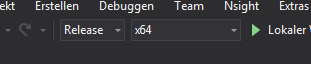

# OpenPose Python API
## Motivation
This is a manual for myself because it took me 4 hours to get this running for the first time 
and I might have to install it again in the future.

This manual is by no means complete, I just detail the steps I took to get it working.

## Prerequisites
* [Visual Studio 15 (2017)](https://visualstudio.microsoft.com/de/downloads/)
    * Install the ***Desktop Development with C++*** Package (you can select it in the Installer)
* [Python 3 (64 bit)](https://www.python.org/downloads/windows/)
* [CMake GUI](https://cmake.org/download/)
* [git](https://git-scm.com/downloads)
* CUDA for NVIDIA GPU (skip if you want to compile for CPU only)
    * [CUDA 10](https://developer.nvidia.com/cuda-toolkit)
    * [cuDNN](https://developer.nvidia.com/rdp/cudnn-download) (requires Nvidia Developer Account)  
    to install just copy the contents into your CUDA installation directory

## Building OpenPose from Source
1. Clone the openpose repository to a location of your convenience  
`git clone https://github.com/CMU-Perceptual-Computing-Lab/openpose`

1. Run CMake
    1. Where is the source code: `<repository location>` (e.g. `F:/openpose`)
    1. Where to build the binaries: `<repository location>/build` (e.g. `F:/openpose/build`)
    1. click *Configure*
        * confirm to create build folder if it does not exist
        * set generator to your Visual Studio version
        * select `x64` as platform for generator
        * leave `Use default native compilers` as is
        * verify that `CUDA_SDK_ROOT_DIR` and `CUDA_TOOLKIT_ROOT_DIR` are set  
        in case of `CUDA_SDK_ROOT_DIR-NOTFOUND` and/or `CUDA_TOOLKIT_ROOT_DIR-NOTFOUND`  
            * set it manually via the ".." Button. Do **not** copy the path from windows explorer 
            (CMake doesn't accept the Backslash Path notation)
            * set `GPU_MODE` to `CPU_ONLY` if you want to use *CPU only* mode
        * set `BUILD_PYTHON` flag
    1. rerun *Configure*
        * in case of pybind11 errors
            * set `PYBIND11_INSTALL` flag
            * set `PYBIND11_PYTHON_VERSION` to 3 (not sure if this is required)
            * rerun *Configure*
    1. click *Generate*
    1. verify that your `<repository location>/build` folder contains the folders `x64` and `python` and the file `OpenPose.sln`

1. Open `OpenPose.sln` with Visual Studio
    1. Switch build configuration from `Debug` to `Release`  
    
    2. build pyopenpose (rightclick - build)

1. To use the python module in your own projects (other than the examples)
    1. Install numpy and opencv  
    `pip install numpy opencv-python`
    1. Copy the DLLs from `<repository location>/build/bin` to  
    `<repository location>/build/x64/Release`
    1. Add `<repository location>/build/x64/Release` to your PATH
    1. Create a new folder `pyopenpose` in `{python_installation}/Lib/site-packages/`
    1. From `<repository location>/build/python/openpose` copy
        * `__init__.py`
        * the contents of the `Release` folder

1. Test it by running from the command line
    * `python`
    * `import pyopenpose`